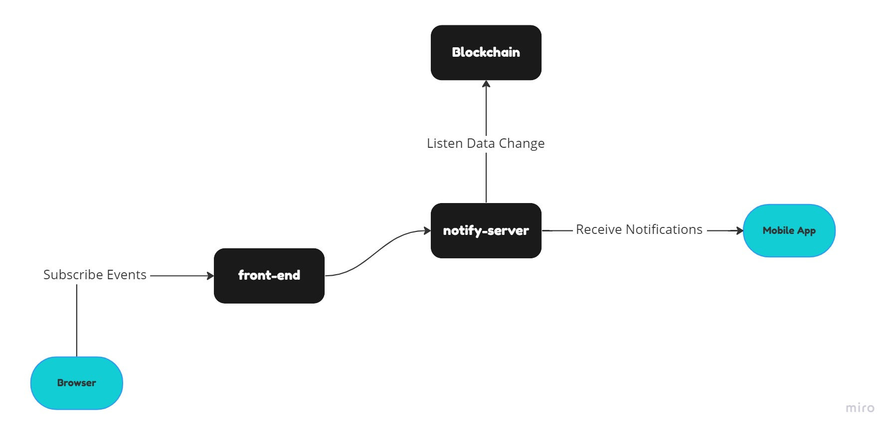
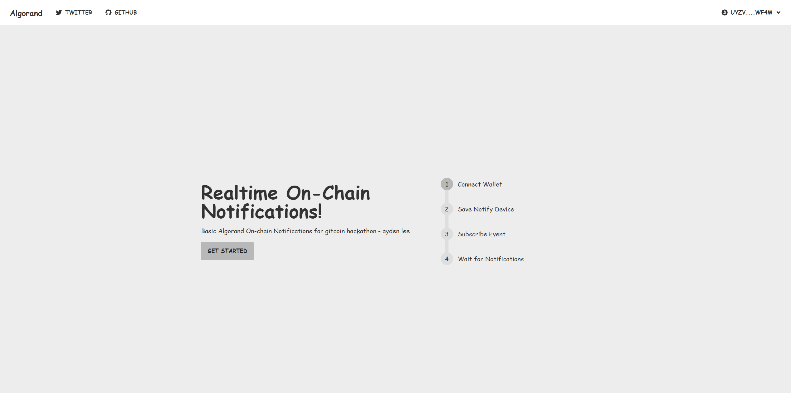
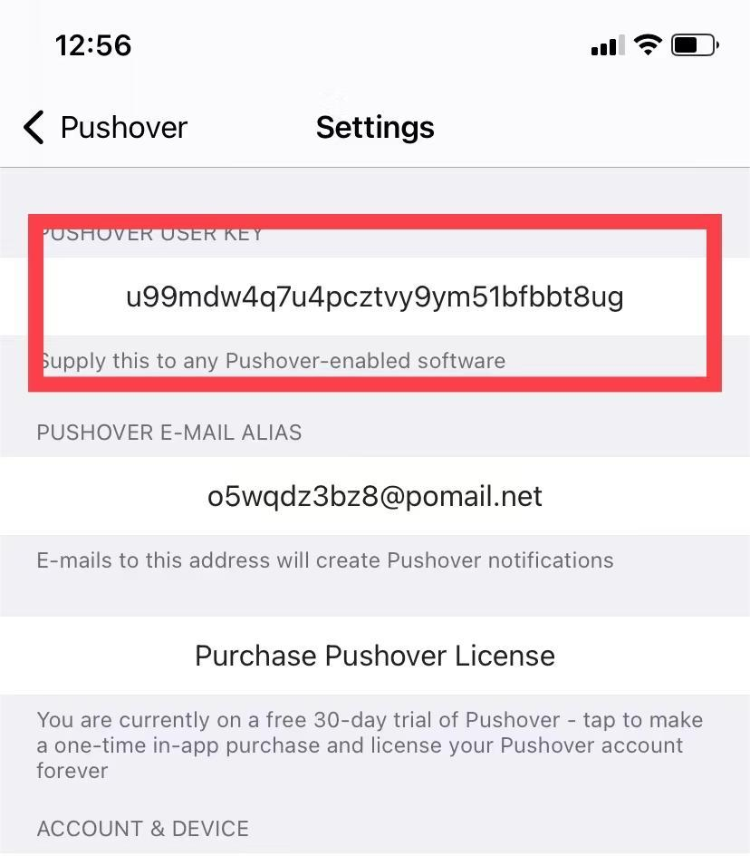

## Overview

This is gitcoin hackathon project.We built an algoland blockchain realtime notifications server.

## flow-chart



## front-end



### tech stack

- nextJS
- tailwindcss
- daisyUi
- vercel platform

We built frontend page using next.js and tailwindcss.After all job done we will deploy frontend codes on vercel platform.

Step by step to subscribe the blockchain events.

-1.Connect Wallet(WalletConnect && Pera Algo Wallet)
-2.Save Notify Device ID(see the details below)
-3.Subscribe Events
-4.Wait for Notifications

Afert all steps done when you trigger events like send token or receive token from faucet you will receive pushed notifications in your mobile app, it's realtime.

[clike me to view the front-end website](https://realtime-notifications-frontend.vercel.app/ "subscribe")

### How do i get the notify push ID ?

We push message to our user via a mobile app named pushover.
You can download the app through the links below.

- [Andriod Download Link](https://play.google.com/store/apps/details?id=net.superblock.pushover)
- [IOS Download Link](https://apps.apple.com/us/app/pushover-notifications/id506088175?ls=1)
- [Website](https://pushover.net/)

After you download the app go to setting page you will find the "PUSHOVER USER KEY".
This key is actually what we want.
We will use this key on our front-end page so you need to copy it down anyway.



## back-end

Back-end github source [https://github.com/coffiasd/realtime-notifications-backend](https://github.com/coffiasd/realtime-notifications-backend "sourcecode")

### tech stack

- golang
- gin framework
- aws server

### http api document

view http api document through [POSTMAN](https://documenter.getpostman.com/view/151598/2s847MpA2X "postman")

Below is a document tree of my golang back-end sourcecode.

```
├─api(http protocol)
├─conf(toml config file)
├─config(parse config file)
├─cron(fetch blockchain server)
├─events(some events)
├─logs(server logs)
├─middleware(redis middleware)
├─router(router)
└─utils(common functions)
```

We build back-end using golang and GIN framework at the same time.This golang server provide a http protocol for our front-end clients to subcribe events or unsubcribe events.
In this demo we only provide 2 kind of events.First is receive event when your wallet address receive some token we will send a message to your mobile through the app i mention above named "pushover". Make sure you already installed the app .And the second event is send event when your wallet address successfuly send some token to other account you will receive the app push message.
It's very convenient.All of our users need to do is just login through mobile wallet like "Pera" and click some buttons.
If you get any question feel free to contrct me. You can also find me in twitter @coffiasse

## youtube

Youtube video address [Link](https://www.youtube.com/watch?v=J_2g5045Tao&ab_channel=ayden-hackathon "sourcecode")
